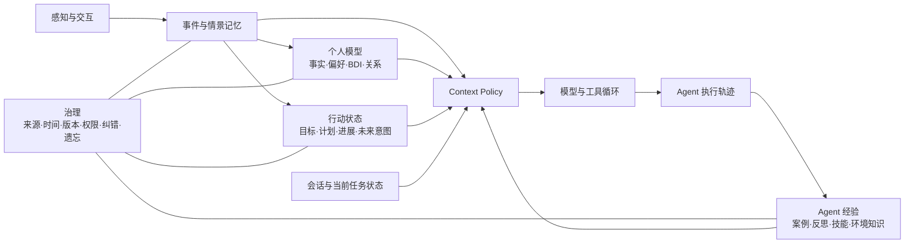

# Agent 记忆研究地图：从个人模型、目标系统到 Runtime

状态：地图 v0.1

证据日期：2026-09-11

适用场景：持续感知用户生活、跨会话理解用户，并帮助用户追踪目标的个人 Agent

## 结论先行

“记忆”不应被设计成一张万能表或一个向量库。真实的个人 Agent 至少有四类长期状态：

1. **关于人的记忆**：发生过什么、用户是谁、相信什么、想要什么。
2. **人的行动状态**：已经承诺的目标、计划、进展和等待未来触发的意图。
3. **Agent 的经验**：过去怎样完成任务、哪些方法有效、环境有哪些坑。
4. **Runtime 工作状态**：当前会话、当前任务、计划栈、上下文预算和恢复点。

它们可以共享检索与上下文装配能力，但写入权、正确性标准、生命周期和用户控制方式不同。首要工作不是统一存储，而是画清对象、来源、消费者和状态转换。

## 1. 先统一几个词

### 1.1 记忆

本文把 Agent 记忆定义为：**由过去的观察、交互或执行结果形成，能够在未来任务中被读取并影响决策的持久状态。**

这个定义不要求所有记忆进入同一个存储。论文与工程框架通常都会区分事实、经历、操作方法和工作状态；[CoALA](https://arxiv.org/abs/2309.02427) 将语言 Agent 描述为模块化记忆、结构化动作空间与决策循环，[LangMem](https://langchain-ai.github.io/langmem/concepts/conceptual_guide/) 则采用 semantic、episodic、procedural 三类长期记忆。

### 1.2 BDI

BDI 不是三种同质标签：

- **Belief**：用户或 Agent 对世界的看法，可能为错，也可能过期。
- **Desire**：希望出现的状态，可能彼此冲突，也不代表已经承诺。
- **Intention**：已经形成承诺、会约束后续选择的部分计划。

“用户提过想跑步”最多支持 desire；只有用户确认并形成持续约束后，才接近 intention。把三者都当作画像事实，会让系统替用户制造承诺。BDI 的经典价值就在于区分世界模型、愿望和已经采纳的计划；意图作为 partial plan 的解释可追溯到 Bratman 的[计划理论](https://web.stanford.edu/group/cslipublications/cslipublications/site/1575861925.shtml)。

### 1.3 Goal

Goal 是规范性状态：它描述“用户决定追什么”，而不是系统从历史里推测“用户可能在意什么”。因此 Goal 可以消费记忆作为建议或进展证据，但正式 Goal、承诺和终态应有独立状态机与用户可见的写入合同。

### 1.4 Session、Context 与 Memory

- **Session state** 保存一次会话的历史和临时状态。
- **Working context** 是某一次模型调用真正看到的有限 token。
- **Long-term memory** 跨会话保存，并在需要时进入 working context。

主流 runtime 已明确分开这些概念。Google ADK 区分 Session/State 与可搜索的 `MemoryService`；OpenAI Agents SDK 也把会话历史与从以往运行中提炼的 Agent memory 分开。[Google ADK](https://adk.dev/sessions/memory/) · [OpenAI Agents SDK](https://openai.github.io/openai-agents-python/sandbox/memory/)

## 2. 全景地图

成熟度标签：

- **共识**：概念边界和基本工程做法有多方独立证据支持。
- **收敛中**：已有多种可用实现，但接口或最佳方案未统一。
- **活跃研究**：近年持续有新结构、训练方法或 benchmark，结果仍依赖场景。
- **开放问题**：缺少可靠定义、因果证据或真实长期评测。

这些标签是本文基于公开研究和工程实现做的综合判断，不代表某个组织发布的标准。同一区域的不同子问题可能处于不同阶段，例如 BDI 理论已有稳定基础，而从自然语言可靠推断用户 BDI 仍是活跃研究。

| 区域 | 核心对象 | 回答的问题 | 当前成熟度 | 个人 Agent 的关键风险 |
|---|---|---|---|---|
| 会话记忆 | messages、summary、checkpoint | 这一轮之前说了什么？ | 共识 | 摘要丢失决定、上下文膨胀 |
| 情景记忆 | event、scene、transcript、action trace | 何时发生了什么？ | 共识 | 说话人、时间与因果归属错误 |
| 语义画像 | fact、preference、relationship | 关于用户，当前相信什么？ | 收敛中 | 把一次表达固化为长期事实 |
| BDI / 自我模型 | belief、desire、intention、evidence | 用户如何看世界、想去哪、承诺了什么？ | 活跃研究 | 错误推断改变 Agent 行为，形成自证循环 |
| 目标与承诺 | goal、milestone、tracker、practice | 用户已经决定追什么，进展如何？ | 收敛中（状态建模）/ 活跃研究（自动推断） | 系统替用户承诺，虚构进度 |
| Prospective memory | deferred intention、cue、deadline、status | 将来何时应该想起并行动？ | 活跃研究 | 只记得内容，却错过触发时机 |
| Agent 经历 | successful/failed trajectory、feedback | 以前做过什么，结果怎样？ | 收敛中 | 复用偶然成功或错误反思 |
| 程序性记忆 | skill、runbook、policy、example | 下次应该怎样做？ | 活跃研究 | 经验过拟合、规则过期、权限越界 |
| 环境记忆 | affordance、workflow、gotcha、state dynamics | 这个环境如何工作？ | 活跃研究 | 环境升级后仍执行旧流程 |
| Context policy | source selection、ranking、budget、rendering | 此时给哪个模型看哪些状态？ | 活跃研究 | 找到了但没用，或高噪声挤掉关键证据 |
| 共享记忆 | scope、owner、audience、lineage | 多 Agent / 多人之间能共享什么？ | 活跃研究 | 信息串租户、来源与责任不清 |
| 遗忘与治理 | correction、retention、deletion、access | 什么应更新、隐藏、删除或过期？ | 开放问题 | 隐私、陈旧人格、删除不完整 |

## 3. 目前可以认为是共识的部分

### 3.1 应按功能分类型，不应只分长短期

“短期/长期”只说明保存多久，没有说明状态用来做什么。事实、事件、技能和当前任务即使都以文本保存，也需要不同的写入和评价合同。2025 年的综述进一步用 factual、experiential、working 三种功能，以及 formation、evolution、retrieval 三种动态来组织该领域。[Memory in the Age of AI Agents](https://arxiv.org/abs/2512.13564)

### 3.2 写入、组织、检索、读取必须分开评价

端到端失败可能来自没有保存、组织时丢失、检索没找到，或模型看到后没有使用。[LongMemEval](https://arxiv.org/abs/2410.10813) 把系统拆成 indexing、retrieval、reading，并单独测试信息抽取、跨会话推理、时间推理、知识更新与拒答。

### 3.3 时间、来源与版本是个人记忆的基本字段

个人事实会变化，BDI 更会变化。只保留当前字符串会丢失“什么时候改变、依据是什么”；只保留事件又会迫使每次读取重新推理当前状态。时间知识图谱、事实演化链和动态链接笔记都在解决这一问题，但采用哪种表示尚未形成统一答案。[Zep](https://arxiv.org/abs/2501.13956) · [A-MEM](https://arxiv.org/abs/2502.12110) · [Mem2ActBench](https://arxiv.org/abs/2601.19935)

### 3.4 上下文越大不等于记忆越好

Working context 是有限注意力预算。可靠做法正在收敛到压缩、渐进披露、按需工具读取和结构化笔记，而不是把全部历史预装进 prompt。[Anthropic 的 Context Engineering](https://www.anthropic.com/engineering/effective-context-engineering-for-ai-agents) 与 Letta 的持久 memory blocks 都体现了这一方向。[Letta memory blocks](https://docs.letta.com/tutorials/attaching-detaching-blocks/)

### 3.5 评测必须走到任务结果

“能回答过去说过什么”不能证明 Agent 会在行动中使用记忆。[Mem2ActBench](https://arxiv.org/abs/2601.19935) 开始测工具选择与参数绑定；[MemoryAgentBench](https://arxiv.org/abs/2507.05257) 同时测检索、test-time learning、长程理解与选择性遗忘。两者都说明单一 QA 分数不足以代表完整记忆能力。

## 4. 仍待研究、且正在快速产生结果的方向

### 4.1 个人模型与人格

需要回答的不是“能否抽出 BDI”，而是：

- 一句话、反复行为和用户确认分别提供多强的证据？
- belief、desire、intention 发生冲突时，谁有权更新当前版本？
- 哪些 BDI 应长期可见，哪些只在相关场景按需读取？
- 注入 BDI 是否真的改善建议与行动，还是只让回复更像用户、更加迎合？
- 用户说“不代表我”后，底层观察、派生模型和缓存如何一致撤回？

BDI 理论本身成熟；**从自然语言历史稳定推断人的 BDI，并安全影响个人 Agent 行为**仍缺少公认 benchmark 和长期因果证据。

### 4.2 目标追踪与“人如何做事”的模型

目标系统至少要区分：愿望、承诺、结果态、执行方法、观察口径、实际行为、复盘与重新规划。关键研究问题包括：

- 什么证据足以把 desire 提议为 Goal，什么动作才算用户采纳？
- 何时坚持原计划，何时因新证据重新考虑？
- 如何从情景证据判定进展，同时保留用户纠错权？
- 如何识别计划外但与目标相关的行动，而不替用户新增承诺？
- 定性目标如何评价，避免伪造一个看似精确的百分比？

经典 BDI 把 intention 看作约束后续推理的承诺。LLM Agent 领域仍在研究长程规划、执行漂移和密集过程信号；近期综述把 planning、memory、execution 与 evaluation 视为贯穿长任务生命周期的不同问题。[The Horizon Gap](https://arxiv.org/abs/2608.06663)

### 4.3 Prospective memory：在正确时机想起

提醒、自动化和延迟动作不是普通事实召回。系统既要保存意图，又要监视时间、事件或环境状态，并保证只执行一次、可以取消、失败可恢复。[PM-Bench](https://arxiv.org/abs/2607.12385) 把它独立成能力后，报告的最佳配置仍只有 65.1% F1；这说明“未来记得做”应有确定性生命周期，不应只靠相似度召回。

### 4.4 Agent 从自身经验中学习

Agent 除了记住用户，还需要记住自己如何完成任务：

- Reflexion 把任务反馈转成文字反思，供后续试次使用；
- Voyager 把成功行为保存为可复用技能；
- ExpeL 从多次轨迹中提炼经验；
- LongMemEval-V2 把环境状态、工作流和 gotcha 当成“有经验同事”应掌握的知识。

[Reflexion](https://papers.nips.cc/paper_files/paper/2023/hash/1b44b878bb782e6954cd888628510e90-Abstract-Conference.html) · [Voyager](https://arxiv.org/abs/2305.16291) · [ExpeL](https://arxiv.org/abs/2308.10144) · [LongMemEval-V2](https://arxiv.org/abs/2605.12493)

未解决的问题是：怎样确认一段轨迹值得固化、怎样避免错误反思污染以后任务，以及技能在工具或环境变化后如何失效。

### 4.5 自管理记忆与统一 Memory Runtime

工程框架正在形成 `add / search / update / delete`、session persistence、namespace、memory block 等接口，但这只是操作接口，不是统一语义。MemOS 尝试把多种记忆作为一等资源；AgeMem 让 Agent 自己决定保存、检索、更新、摘要和丢弃。[MemOS](https://arxiv.org/abs/2505.22101) · [AgeMem](https://arxiv.org/abs/2601.01885)

仍待证明：自管理 controller 能否跨模型与任务泛化；统一底座是否真的降低复杂度；领域状态被抽象成通用 memory 后是否反而丢失事务、权限和终态语义。

### 4.6 多模态、共享与可信记忆

活跃前沿还包括视觉/屏幕记忆、多 Agent 共享、跨设备迁移、隐私保留的遗忘、记忆投毒与权限隔离。MIRIX 把多模态记录拆为六类记忆；近期综述也把 multimodal、multi-agent 与 trustworthiness 列为主要前沿。[MIRIX](https://arxiv.org/abs/2507.07957) · [Agent Memory Survey](https://arxiv.org/abs/2512.13564)

这些方向有连续成果，但远未形成稳定产品合同，尤其缺少跨月真实用户研究。

## 5. Morii 当前落在地图哪里

以下判断来自 `aria-agent` 当前代码与 ADR，只描述职责，不公开部署与内部接口信息。

### 已经存在

| 区域 | 当前能力 | 判断 |
|---|---|---|
| 情景记忆 | 上游服务拥有 episodic 写入和索引；`aria-agent` 只读 | ownership 清楚，符合单一真源 |
| Runtime 读取 | 搜索、按时间浏览、读取原文、读取当前上下文；支持混合召回与分层展开 | 已是面向模型的记忆工具面，不只是数据库查询 |
| 画像与 BDI | 事实画像、原子 BDI、核心 BDI 版本、证据、用户隐藏与重新生成 | 已覆盖“观察 → 提炼 → 反馈”的主要形状 |
| Goal | Goal、tracker、milestone、practice、活动账本、回顾、重新判定 | 已经是独立行动域，不应退回通用 memory CRUD |
| BDI → Goal | Goal 建议读取 desire / intention 作为方向偏置，belief 被排除，进展证据仍来自情景记录 | 边界正确：个人模型影响建议，但不冒充行为证据 |
| 会话状态 | chat message、滚动摘要、流恢复和每轮动态 context | 已有短期连续性机制 |

### 目前的断点

1. **BDI 主要服务画像展示和 Goal 专用链路，尚未成为通用 Chat Runtime 的稳定输入。** 通用 chat prompt 里的 User Profile 和 Recent Hot Observations 仍是空占位。这不是简单“接上线”问题：常驻注入、按需读取和完全不注入会产生不同偏差，应该先评测。
2. **Runtime 的记忆工具目前围绕 episodic memory 设计。** Profile、BDI、Goal 和 Agent experience 没有共同的来源选择与上下文装配策略。
3. **Goal 已有强领域语义，但与 prospective memory 的关系仍需画清。** Goal、Todo、Automation 分别表达长期方向、一次性任务和未来触发动作，不应因“都与未来有关”而合成一个状态机。
4. **缺少 Agent 自身的 experiential / procedural memory。** 当前系统会保存聊天和业务产物，但没有一条已证明的链路把执行成功、用户纠正和失败原因提炼成以后可复用的工作方法。
5. **评价仍按产品能力分散。** 缺少一组能同时定位 formation、retrieval、reading、action 与 correction 的真实业务样本。

因此 Morii 需要的是**统一的地图与读取策略，不是统一的数据库**。

## 6. 建议形成的研究组合

### P0：先建立三条真实证据链

#### A. BDI 使用效果

固定同一批证据，对比三种 Runtime 策略：不提供 BDI、常驻提供核心 BDI、按需工具读取 BDI。评价：建议是否更相关、是否错误固化人格、是否引用了可追溯证据、用户纠正后是否停止使用旧判断。

#### B. Goal 连续性

用真实目标的多周事件构造任务：目标更新、承诺冲突、计划改变、进展判定、当前焦点与下一步。分别测 source coverage、状态判断和最终建议，避免只测一段回顾文案是否“好看”。

#### C. Runtime 记忆使用

给定多个可选来源，测 Agent 是否选择正确来源、是否继续精读、是否采用最新有效值，并最终正确完成工具参数或业务动作。本文仓库的[研究方向 001](001-memory-representation-and-reader-capacity.md)属于这条线中的一个窄实验。

### P1：再研究两个高价值缺口

1. **个人状态的时间版本链**：事实、偏好与 BDI 在什么变化密度下适合平铺、当前快照或版本链；结果按模型 checkpoint 和任务类型报告。
2. **Agent 经验记忆**：从用户纠正、失败终态和成功轨迹中，只提炼可验证的“下次怎么做”；环境或工具版本变化时自动失效。

### P2：证据出现后再扩展

- Prospective memory 的事件触发与取消语义；
- 多 Agent / 家庭成员共享记忆；
- 多模态长期检索；
- learned memory controller；
- parametric 或 latent memory。

这些方向很活跃，但当前没有证据表明它们比 P0 的读取与作用验证更阻塞 Morii。

## 7. 地图的维护规则

新增一个研究方向时，必须回答：

1. 它保存的是事实、经历、承诺、技能还是当前工作状态？
2. 谁写入，谁能纠正，谁拥有最终真源？
3. 状态如何产生、更新、冲突、过期和删除？
4. 它在什么任务中被读取，最终影响哪个可观察动作？
5. 失败能否定位到 formation、evolution、retrieval、reading 或 action？
6. 当前证据属于共识、工程收敛、活跃研究还是开放问题？

答不清这些问题时，先保留为研究问题，不新增平台抽象。

## 参考资料

1. Sumers et al. [Cognitive Architectures for Language Agents](https://arxiv.org/abs/2309.02427), 2023.
2. Hu et al. [Memory in the Age of AI Agents](https://arxiv.org/abs/2512.13564), 2025/2026.
3. Wu et al. [LongMemEval](https://arxiv.org/abs/2410.10813), ICLR 2025.
4. Hu et al. [MemoryAgentBench](https://arxiv.org/abs/2507.05257), 2025.
5. Shen et al. [Mem2ActBench](https://arxiv.org/abs/2601.19935), ACL 2026.
6. Wu et al. [LongMemEval-V2](https://arxiv.org/abs/2605.12493), 2026.
7. Liu and Gabriel. [PM-Bench](https://arxiv.org/abs/2607.12385), 2026.
8. Anthropic. [Effective context engineering for AI agents](https://www.anthropic.com/engineering/effective-context-engineering-for-ai-agents), 2025.
9. Google ADK. [MemoryService](https://adk.dev/sessions/memory/).
10. OpenAI Agents SDK. [Agent memory](https://openai.github.io/openai-agents-python/sandbox/memory/).
