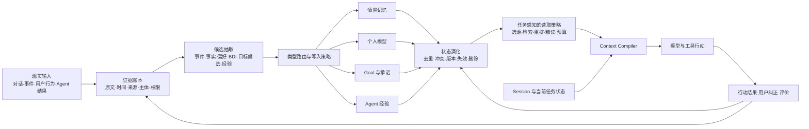

# 个人 Agent 记忆管线参考架构

状态：架构草案 v0.1

适用场景：从现实对话和行为中形成长期状态，并让个人 Agent 在后续任务中可靠使用

## 1. 架构目标

记忆系统的核心不是某种数据库，而是一条可追踪的闭环：

> 现实证据 → 记忆候选 → 类型与权属判断 → 状态演化 → 按任务读取 → Agent 行动 → 结果与纠正回流

如果系统只做到“从对话抽取并保存”，只能证明信息进入了存储。只有当后续任务选择了正确版本、读到了原始证据，并改善了可观察行动，才能证明这段记忆有效。



## 2. 管线的七个阶段

### 2.1 现实输入

输入不仅是聊天消息，还包括：

- 用户明确陈述；
- 环境中观察到的事件；
- 用户实际采取的行动；
- Agent 的工具调用、成功结果与失败终态；
- 用户对记忆或行动的确认、否认和纠正。

这些输入的证据强度不同。“用户说想跑步”不能直接等价于 Goal，“连续三天晚上跑步”也不能自动证明用户作出了长期承诺。

### 2.2 证据账本

先保存可追溯证据，再生成解释。证据至少需要：

| 字段 | 用途 |
|---|---|
| `evidence_id` | 稳定引用原始证据 |
| `source_type` / `source_id` | 区分对话、感知事件和执行轨迹 |
| `subject` / `speaker` | 防止把别人的话写成用户事实 |
| `observed_at` | 记录何时观察到 |
| `event_time` | 记录事件实际发生时间 |
| `scope` | 用户、家庭、任务或 Agent 私有范围 |
| `content_ref` | 指向原文、转录或结构化事件 |
| `deletion_ref` | 支持来源删除后的派生状态清理 |

证据账本适合追加和纠正，不应被当前画像覆盖。它回答“系统依据什么这样判断”。

### 2.3 候选抽取

抽取器只生成候选，不直接宣布长期真相。统一候选信封可以包含：

```json
{
  "kind": "fact | preference | belief | desire | intention | goal_candidate | episode | procedure",
  "subject": "user",
  "content": "晚饭后跑步",
  "evidence_refs": ["evidence-id"],
  "valid_from": "optional",
  "confidence": 0.0,
  "extractor": "model-and-prompt-version"
}
```

`confidence` 只能表达抽取器的不确定性，不能代替用户授权，也不能把 desire 升级成 intention。

### 2.4 类型路由与写入策略

不同类型必须采用不同的写入合同：

| 类型 | 默认写入策略 | 最终权威 |
|---|---|---|
| 已发生事件 | 有可靠来源时自动追加 | 原始事件与来源 |
| 事实、偏好 | 合并为候选当前状态，保留版本和反证 | 最新有效证据 + 用户纠正 |
| Belief | 保存为带主体和时间的观点 | 用户表达或明确推断状态 |
| Desire | 可自动提出，不自动变成承诺 | 用户当前表达 |
| Intention / Goal | 候选可以自动生成，正式采纳需要明确产品动作 | 用户确认 + Goal 状态机 |
| Agent 经验 | 只有结果可验证后才能提炼 | 执行结果、环境版本和评价 |
| Session 状态 | 按运行时协议更新 | 当前会话或任务执行器 |

统一候选信封可以减少重复接入，但不能抹平这些写入差异。

### 2.5 状态演化

长期记忆不是一次性 `insert`。演化层至少要表达：

- `confirmed`：当前有证据支持；
- `superseded`：被较新的状态替代；
- `disputed`：存在冲突，尚不能确定当前值；
- `rejected`：用户明确否认；
- `expired`：环境或时效条件已经变化；
- `deleted`：按照用户请求或来源删除传播清理。

事实和 BDI 可以使用版本链；Goal 应继续使用自己的领域状态机；Agent 技能还需要绑定工具和环境版本。它们可以共享版本、来源和权限能力，但不应共享一套业务状态机。

### 2.6 按任务读取

读取不是一个全局 `search(query)`。它应先根据当前任务决定需要哪些来源，再执行：

1. **选源**：当前任务需要事件、画像、Goal、经验还是会话状态？
2. **检索**：在相应来源中找候选。
3. **重排**：综合相关性、时间有效性、证据强度、状态和权限。
4. **精读**：需要时展开原文和版本链，避免只依赖摘要。
5. **编译上下文**：在 token 预算内形成模型可读输入，并保留记忆 ID 与证据引用。

Context Compiler 是管线的关键组件。它不拥有任何领域真源，只决定本次模型调用看什么、按什么顺序看，以及允许继续读取什么。

### 2.7 行动、评价与纠正回流

每次使用长期记忆的行动应产生一条可审计记录：

- 当前任务；
- 读取了哪些记忆及版本；
- 展开了哪些证据；
- 形成了什么建议或工具参数；
- 行动是否成功；
- 用户是否接受、纠正或否认；
- 纠正是否传播到画像、BDI、Goal 和缓存。

这条记录既用于评价，也是以后形成 Agent 经验的原材料。执行轨迹不能未经结果判断直接写成“成功经验”。

## 3. 应统一什么，不应统一什么

### 3.1 可以统一的基础合同

- 稳定 ID、主体、作用域与权限；
- 来源引用和证据展开；
- 观察时间、有效时间和版本；
- 当前状态、冲突、隐藏和删除传播；
- 读取 trace、token 成本和延迟；
- 抽取器、模型、prompt 和 schema 版本。

### 3.2 应由领域拥有的语义

- BDI 的证据门槛和用户纠正；
- Goal 的采纳、暂停、完成和放弃；
- 自动化任务的触发、幂等、取消与失败恢复；
- Agent 技能的成功标准和环境兼容性；
- Session 的 checkpoint 与恢复语义。

架构统一的是证据和流转合同，不是一张万能表，也不是一个覆盖全部状态的 CRUD 服务。

## 4. 开源组件处在管线的什么位置

| 项目或思路 | 主要覆盖 | 可以借鉴 | 不能替代的 Morii 语义 |
|---|---|---|---|
| [Mem0](https://arxiv.org/abs/2504.19413) | 候选抽取、更新、检索 | 记忆写入与更新管线、图扩展 | BDI 授权、Goal 状态、真实业务证据合同 |
| [Zep / Graphiti](https://arxiv.org/abs/2501.13956) | 时间知识图谱 | 事实变化、关系和有效时间 | 用户承诺、任务终态、Context Policy |
| [LangMem](https://langchain-ai.github.io/langmem/concepts/conceptual_guide/) | semantic / episodic / procedural memory | namespace、后台提炼、Agent memory API | 个人模型的产品定义和纠错权 |
| [Letta memory blocks](https://docs.letta.com/tutorials/attaching-detaching-blocks/) | 常驻和可挂载上下文 | 明确哪些内容对 Agent 可见 | 上游证据形成、版本演化和行动评价 |
| [Google ADK MemoryService](https://adk.dev/sessions/memory/) | Session 与长期搜索接口 | Runtime 接口分层 | 记忆类型、领域状态和写入政策 |

这些项目可以作为某一层的实现候选。选择开源或自研之前，应先用同一批真实案例检验它能否满足 Morii 的证据、版本、纠正和读取合同。

## 5. 映射到 Morii 当前系统

根据 `aria-agent` 当前代码和 ADR，可以先这样放置 owning layer：

| 管线阶段 | 当前 owning layer | 当前判断 |
|---|---|---|
| 情景证据写入与索引 | 上游感知与记忆服务 | 已有单一写入方 |
| 情景记忆读取 | `aria-agent` 的 memory tools | 已有搜索、时间浏览、原文精读和上下文读取 |
| 画像与 BDI | 画像 / BDI 领域服务 | 已有事实、原子观察、核心版本和用户反馈 |
| Goal 与进展 | `aria-agent` Goal domain | 已有独立状态与情景证据消费 |
| Session 与当前任务 | `aria-agent` runtime | 已有消息、摘要、流恢复和每轮 context |
| 跨来源 Context Policy | 尚未形成稳定 owning layer | 当前主要断点 |
| Agent experiential / procedural memory | 尚未形成已证明闭环 | 当前高价值缺口 |
| 端到端记忆评价 | 分散在各产品能力 | 需要统一 trace 和真实案例集 |

因此近期不需要搬迁现有真源。第一步应在现有边界之上建立统一读取 trace 和评价协议，用证据决定后续是否需要独立的 Memory Runtime。

## 6. 第一个可验证的纵切

选择一种会发生变化的个人状态，例如作息、锻炼时间或沟通偏好，走通完整闭环：

1. 从真实多轮对话记录原始证据；
2. 抽取事实或偏好候选，不自动生成 Goal；
3. 新证据出现时形成版本链，而不是覆盖原文；
4. 在后续规划任务中由 Context Policy 选择当前版本；
5. 展开来源后生成建议或工具参数；
6. 用户指出“那只是临时安排”后，旧判断失效；
7. 再次执行相同任务时不继续使用被否认的状态。

这个纵切同时覆盖 formation、evolution、retrieval、reading、action 和 correction，能够暴露真正的架构断点。

## 7. 最小评价面板

| 阶段 | 指标 | 失败示例 |
|---|---|---|
| Formation | 候选抽取准确率、证据归属准确率 | 把他人的话写给用户 |
| Evolution | 当前状态准确率、冲突与版本识别率 | 新旧偏好同时被当成当前值 |
| Retrieval | 有效证据召回率、陈旧记忆召回率 | 找到相关但已失效的记录 |
| Reading | 证据使用正确率、拒答率 | 找到证据却绑定错工具参数 |
| Action | 任务成功率、错误行动率 | 建议或执行违背当前 Goal |
| Correction | 纠正传播率、旧状态泄漏率 | 用户否认后仍继续使用 |
| Cost | 读取延迟、token、存储与更新成本 | 精度提升依赖不可接受的全量上下文 |

主指标应落在最终行动和纠正效果上；抽取准确率只是诊断指标。

## 8. 架构决策顺序

1. 冻结统一的证据与读取 trace，不迁移现有领域数据。
2. 建立一批人工审定的真实纵切案例。
3. 让当前实现、一个开源方案和必要的轻量自研方案跑同一协议。
4. 根据失败归因决定改抽取、版本演化、检索、Context Policy 还是领域状态机。
5. 只有多个领域反复需要相同能力时，才把它提升为通用 Memory Runtime。

这一顺序让架构由真实失败推动，而不是由某个框架的数据模型反推产品。
